### Diagram Arsitektur Website

Berikut adalah diagram arsitektur website MBC Laboratory:
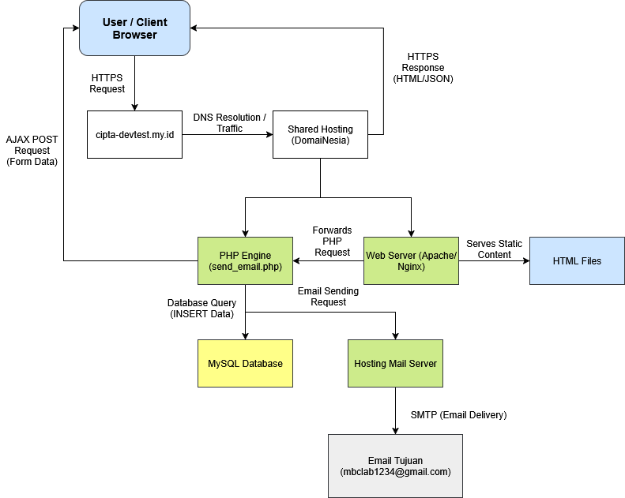

---

### Alur Kerja Form Kontak

Berikut adalah flowchart alur kerja form kontak:
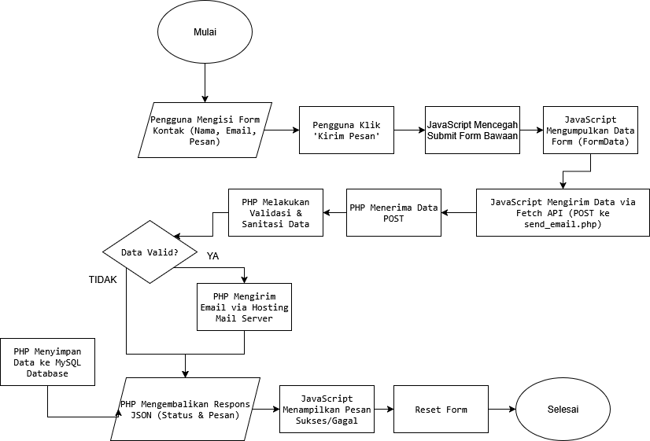

---

### Screenshot Halaman Website

Berikut adalah tampilan setiap halaman website:

**Halaman Home & Divisi:**

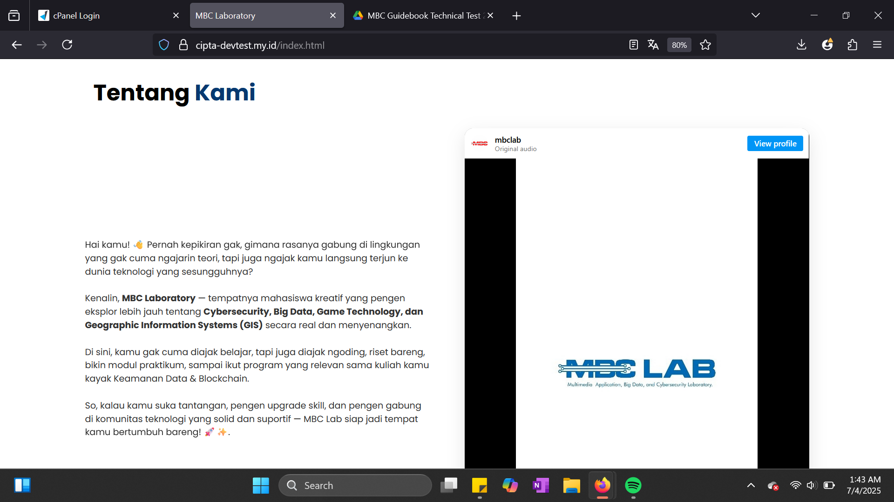

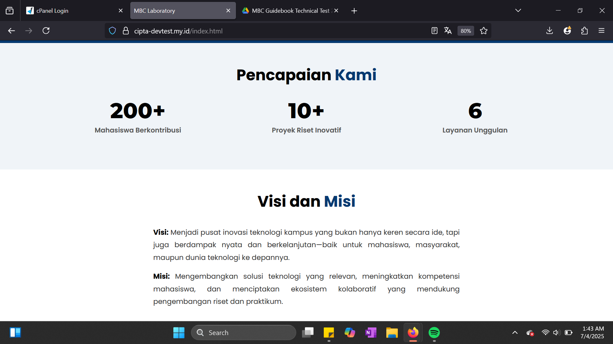

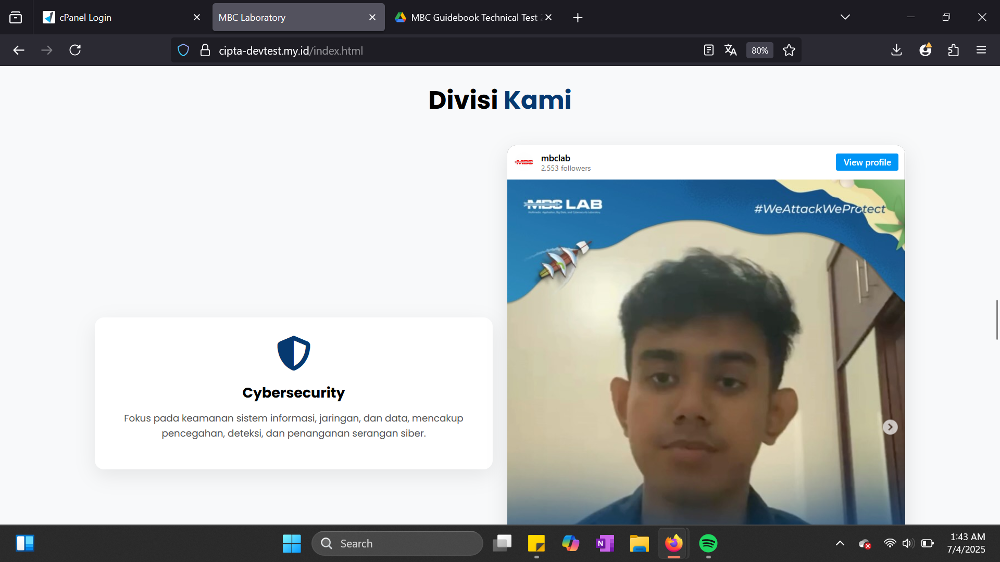
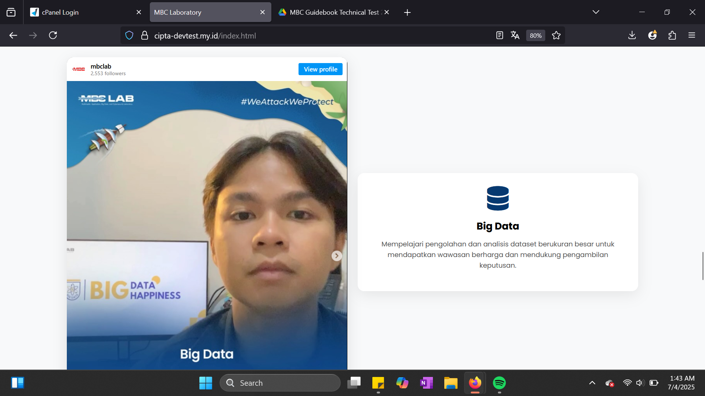
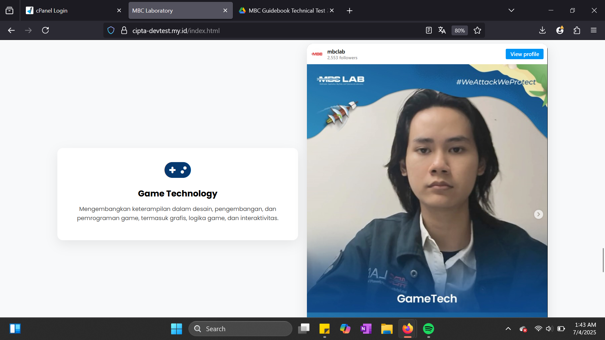
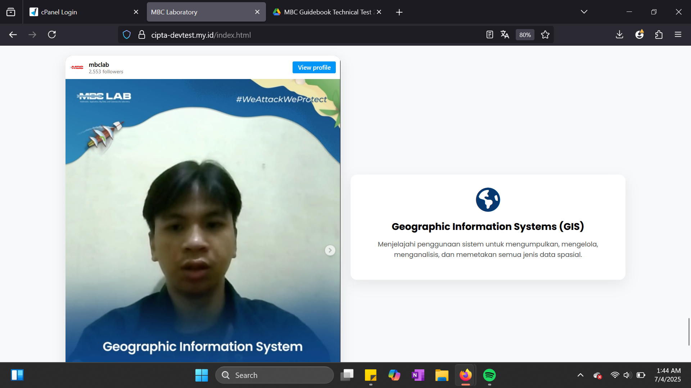
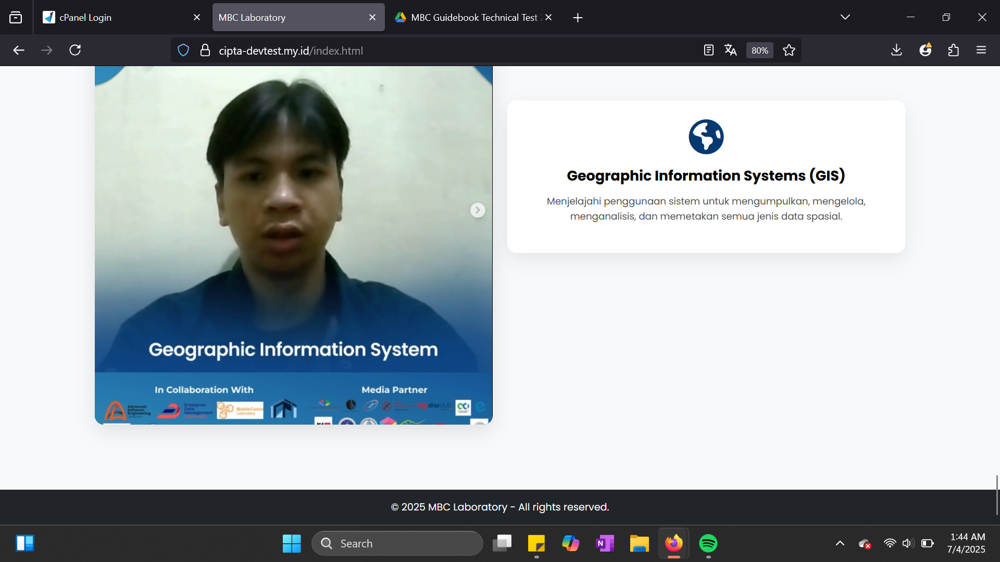

**Halaman Kontak:**
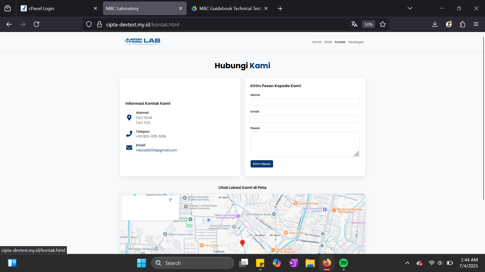
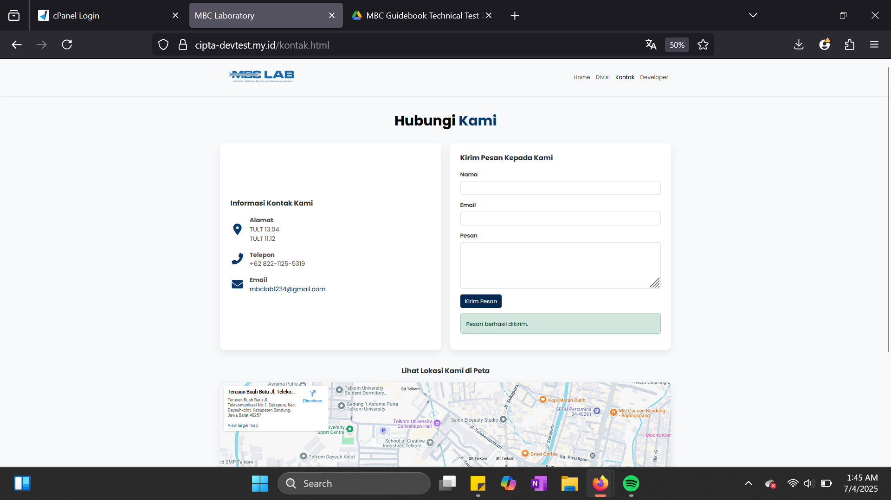

**Halaman Developer:**
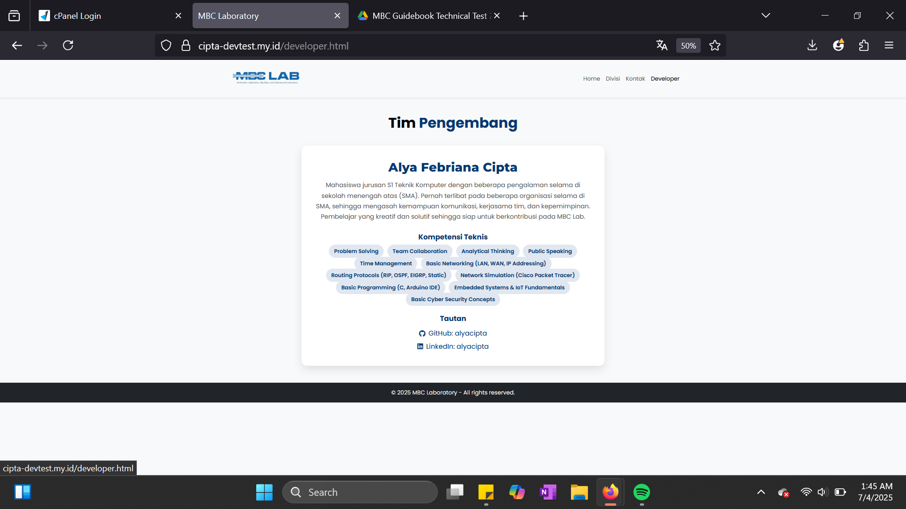