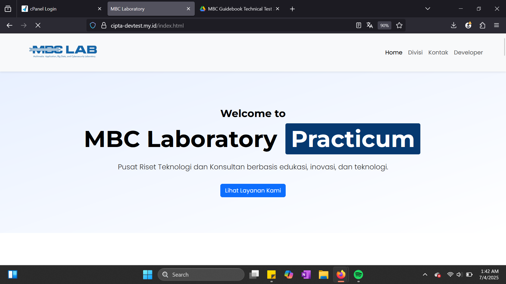
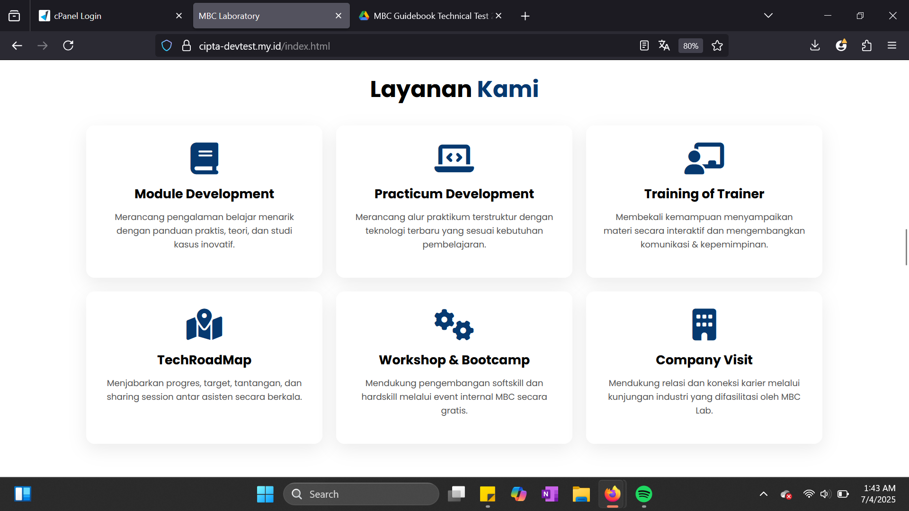

### Diagram Arsitektur Website

Berikut adalah diagram arsitektur website MBC Laboratory:

---

### Alur Kerja Form Kontak

Berikut adalah flowchart alur kerja form kontak:

---

### Screenshot Halaman Website

Berikut adalah tampilan setiap halaman website:

**Halaman Home & Divisi:**

**Halaman Kontak:**

**Halaman Developer:**
